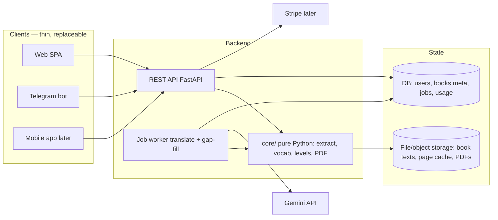

# Architecture — Leveled Reading Platform

Target: turn the local pipeline into a multi-user service where the SAME
backend serves a web app, a Telegram bot, and later a mobile app. Users own a
library, translations are metered, higher limits are paid.

Status: BUILT & DEPLOYED (Phases 1–2b done, 2c mostly). Live at
https://readersimple.duckdns.org. This doc is kept in sync with reality;
sections marked "as built" describe the running system, not just intent.

## 1. System overview



Rules that make it scale:

- **Clients contain no logic.** Web/bot/mobile only call the REST API. A new
  client platform = a new thin client, zero backend work.
- **core/ is pure.** No HTTP, no DB, no globals — functions in/out. It is
  today's `pipeline.py` + `vocab_common.py` + `build_pdf.py`, repackaged.
  Everything else can be replaced without touching it.
- **Translation is a queued job**, never an HTTP request that blocks. Clients
  poll (or subscribe to) job progress — same as today's job.json, but per user.
- **Every Gemini call goes through the quota gate.** No exceptions; this is
  both the cost control and the product (limits are what Plus removes).

## 2. Components

| Component | v1 (one VPS) | v2 (growth) |
|---|---|---|
| API | FastAPI + uvicorn | same, more replicas |
| DB | SQLite | PostgreSQL |
| Files | shared `data/site/library/<hash>/` + per-user refs | S3/GCS bucket |
| Job queue | one worker thread per process | Redis + arq/Celery workers |
| Auth | JWT sessions; Google OAuth + Telegram Login | + Apple/Facebook |
| Payments | — | Stripe Checkout + webhooks |
| Deploy | Docker Compose behind Caddy (auto-HTTPS) | container platform |

The v1→v2 swaps are behind interfaces (Storage, Queue, DB session), so they
are upgrades, not rewrites.

## 3. Data model — as built (shared library + ownership refs)

The big decision (Phase 2c): book text and its translations are **content
that many users share**, not per-user copies. Users own *references*, not
files. This came from research — the vocab-guided vs generic coverage gap
is only ~1.6 pp at levels 25/50, so one translation serves many.

**DB (SQLite, `data/site/app.db`)** — accounts, jobs, counters only:
```
users        id, created_at, tier(free|plus), email?, google_sub?, tg_id?, name
jobs         id, user_id, book_slug, level, page_from, page_to, baseline,
             status(queued|running|done|quota|error), done, total, cached,
             current_page, eta_s, error, created_at, started_at, finished_at
job_events   id, job_id, ts, type(page_done|job_done|job_quota|…), payload
usage        user_id, day, pages          (daily translation quota counter)
payments     (Phase 3) id, user_id, provider, amount, period, status, raw
```

**Files** — the heavy, immutable content:
```
data/site/library/<text_hash>/            SHARED, deduped by normalized text
    book.txt  meta.json(hash,title,pages)  word_dict.json
    simplified/page<N>_L<lvl>.json          guided translation
    simplified/page<N>_L<lvl>_base.json     baseline (no-vocab) translation
data/site/users/<uid>/
    known/<slug>.json                       per-user vocabulary sources
    books/<slug>/ref.json                   OWNERSHIP: {hash, name, title,
                                            added_at, pages_read}
```

`pipeline.book_dir(slug)` reads the user's `ref.json` and resolves to the
shared `library/<hash>` — the single choke point that makes every existing
function (stats, translate, reader, PDF) shared-storage-aware unchanged.
Uploading identical text → same hash → **one stored copy; the second user
instantly sees existing translations.**

Cache key = `(text_hash, page, level, guided|baseline)`. Guided output
depends on the *vocabulary* used; today it's shared across all users of a
book (acceptable per the coverage research). Serving guided caches only to
users with *similar* vocabularies is Phase 2c.3 (vocab-similarity gate,
not yet built). Baseline output uses no vocabulary → universally shareable.

`user_documents` as a DB table (vs today's `ref.json` files) is the natural
Postgres-era form; the file refs carry the same fields and migrate 1:1.

## 4. API contract (v1)

```
POST /auth/google            id_token -> JWT
POST /auth/telegram          Telegram Login payload -> JWT
GET  /me                     profile + tier + quota usage

GET/POST/DELETE /known       known-vocab sources (upload = raw body)
GET/POST/DELETE /books       target books
GET  /books/{id}/stats       coverage, sample words, per-page %, level curve

POST /books/{id}/translate   {level, from, to} -> job id  (quota-gated)
GET  /jobs/{id}              progress: done/total/pct/eta/errors
GET  /books/{id}/reader?level=  simplified pages + hover dictionary
GET  /books/{id}/pdf?level=&mode=  repeat|norepeat|spaced|clean

GET  /billing/plans          (later) plans; POST /billing/checkout
POST /billing/webhook        (later) Stripe -> set tier
```

Auth: `Authorization: Bearer <JWT>`. The Telegram bot exchanges its chat's
`tg_id` for a service JWT — the bot process holds one bot token, users never
see keys.

## 5. Limits policy — as built

Enforced server-side: storage on upload (`api/routes.read_upload` +
`pipeline.storage_used`), translation on job creation + counted by the
worker (`api/limits.py`, `usage` table). REQUIRE_AUTH=1 in prod, so every
call needs a valid JWT.

**A user's footprint = their own known-vocab files + the shared-library
content they reference** (`storage_used(uid)`; each referenced book counted
once). Same book referenced by two users is stored once on disk but counts
toward both quotas — conservative on purpose.

| Limit | Free (live) | Plus (Phase 3) | Where |
|---|---|---|---|
| Storage / user | **100 MB** | 1 GB | `pipeline.STORAGE_LIMIT`, 413 on upload |
| Translated pages / day | **100** (uncached only) | 2000 | `limits.DAILY_PAGES` |
| Concurrent jobs | **1** | 3 | `limits.MAX_CONCURRENT_JOBS` |
| Pages per translate request | **200** | — | `limits.MAX_RANGE` |

Cached pages are always free and never count. `/me` returns live storage and
daily-page usage; the web header and Telegram bot show it.

Behavior at the limit: upload → 413 with a clear message; translate → 429
naming pages left today; a mid-job Gemini 429 parks the job as `quota`,
resumable later for free (done pages are cached). Not yet built: monthly
caps, per-day Gemini-request cap, PDF-build cap, one-tap upgrade (Phase 3).

Cost sanity: one page ≈ 5k in / 1.5k out tokens on flash-lite ≈ $0.001.
Free tier per user ≈ $0.10/month worst case; Plus heavy user ≈ $2/month —
margins work at even a $3–5/month subscription.

## 6. Payments (Phase 3)

Stripe Checkout (no card data touches our server). `tier` on `users` is set
ONLY by Stripe webhooks (subscribe, renew, cancel). Grace period on failed
renewal: 7 days, then back to free — library is kept read-only, never
deleted. Prices: single Plus plan first; regional pricing later.

## 7. Queues (input / output)

Queue WHERE it pays, not everywhere:

- **Input queue — translate jobs: YES.** Gemini free tier forces sequential
  calls anyway; a queue makes that a feature: fairness between users (FIFO
  round-robin per user), retry after 429, resume after crash/deploy, and the
  quota gate has one natural checkpoint. v1 = a `jobs` table polled by one
  worker (what job.json does today, but in the DB); v2 = Redis when >1 worker.
- **Output queue — job events: YES.** The worker emits events (`page_done`,
  `job_done`, `job_quota`, `job_error`) into a `job_events` table. Consumers:
  web client polls progress, Telegram bot pushes "your book is ready",
  monitoring turns `job_error` into an alert. One event stream feeds all three.
- **Uploads, stats, reader, PDF: NO queue.** They are fast synchronous work;
  a queue would only add latency and moving parts.

## 8. Code delivery: git + Docker + CI

- **Public GitHub repo: OK** (user data and secrets never enter git —
  `data/`, keys, `.env` are gitignored; code itself has no secrets). Public
  gives free CI minutes, free secret-scanning + push protection (GitHub
  blocks a commit containing an API key), easy sharing. Add a LICENSE (MIT)
  and a README.
- **Docker in one paragraph:** a Dockerfile freezes the app + Python + fonts
  into an image; the image runs identically on your PC and the VM (no
  "works on my machine"); `docker-compose.yml` declares the whole stack
  (api, worker, caddy) so the server needs exactly two commands:
  `git pull && docker compose up -d --build`. Rollback = checkout previous
  tag, same command.
- **Alternatives considered:** bare venv + systemd (fewer parts but the
  server drifts from your PC — rejected); Kubernetes (overkill for 1 VM);
  PaaS (ephemeral disk problem, §1). Compose is the sweet spot.
- **CI (GitHub Actions):** on every push — run tests; on tag — build image,
  push to registry, SSH to VM, `compose up`. Deploy becomes `git push`.

## 9. Monitoring, logs, alerts -> Telegram

v1 is deliberately small — one `monitor.py` on the VM, run by cron every
5 min, sending Telegram messages via the same bot to your chat id:

- **Alerts:** disk >85%, RAM/swap pressure, api /health failing, worker
  stuck (job running with no event for >10 min), job_error events, Gemini
  429/5xx streak, daily spend estimate over threshold, cert expiry <14 d,
  backup older than 25 h.
- **Logs:** structured JSON lines from api+worker into files rotated by
  Docker (`max-size`); `docker compose logs` for eyes-on;
  optional `/admin/stats` page (queue depth, jobs today, requests today,
  per-user usage) — the same numbers the monitor reads.
- Grafana/Loki/Prometheus only if the single-file monitor stops being
  enough; don't start there.

## 10. Security

### Gemini key protection (defense in depth)

1. The key exists ONLY on the server, in `/opt/app/.env` (chmod 600, owner
   root), injected into containers as env vars; never in git, never sent to
   any client, never in logs (error messages are scrubbed — already done).
2. All spending goes through the quota gate (§5): even with public clients,
   a stranger can at most burn one free-tier user's daily allowance.
3. Separate keys for dev (your PC) and prod (VM) — a leaked dev key doesn't
   touch production; rotation = replace one env var and restart.
4. Billing alarm on the Google account (budget alert at a few $) + the
   monitor's daily-spend alert (§9) as the second pair of eyes.
5. GitHub push protection on (free on public repos) — a key pasted into
   code by accident is blocked at commit time.

### General

- Secrets (Gemini key, JWT secret, Stripe keys) only via env vars — never in
  the repo or client.
- Upload caps enforced before reading the body; MIME/extension allowlist
  (pdf, txt, csv); extraction in a subprocess with timeout (exists today).
- Per-user rate limiting on all mutating endpoints, IP limiting on /auth.
- HTTPS everywhere (Caddy). CORS: exact origins of the web client.
- Copyright: users' books are private to them; ToS states user is
  responsible for uploaded content; no public sharing of derived texts in v1.

## 11. Migration phases

- **Phase 0 — now.** Local single-user app. DONE.
- **Phase 1 — split.** Extract `core/` package; wrap it in FastAPI with the
  API above; SQLite + local files; JWT with a single local user; current
  app.html becomes a static SPA calling the API. Local behavior identical.
- **Phase 2 — users + bot.** Google OAuth + Telegram Login; per-user data
  dirs; quota gate with the Free column; Telegram bot client; deploy to a
  VPS (Docker Compose + Caddy + domain).
- **Phase 3 — money.** Stripe, Plus tier, usage dashboards, email receipts.
- **Phase 4 — scale/mobile.** Postgres + object storage + Redis queue when
  metrics demand; mobile app on the same API.

Each phase ships alone and the app works at the end of it.
